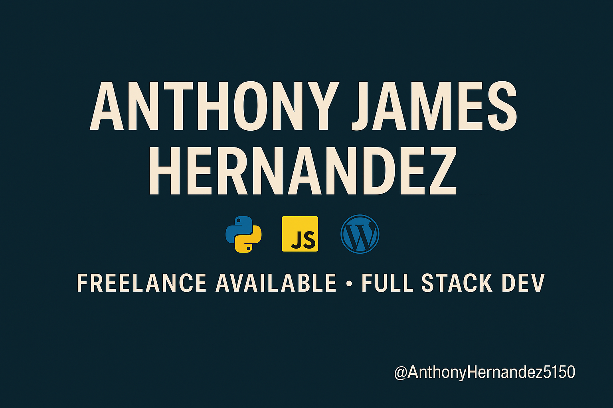

# 👨‍💻 Anthony James Hernandez

**Self-Taught Web Developer | Python 🐍 | JavaScript ⚡ | WordPress 🔧**  
Fixing bugs, building full-stack apps, and turning chaos into clean code.

---

## 🚀 What I Do
- 🛠 Fix WordPress bugs fast, secure, and clean
- ⚙️ Automate tasks and optimize websites
- 🌐 Build responsive, full-stack web apps
- 🔍 Debug like a digital detective

---

## 🧰 Languages & Tools

---

## 🔍 I'm Currently Working On:
- 💻 Building a project to showcase on my GitHub (coming real soon!)
- 🧠 Leveling up my JavaScript and API integration skills
- 🧩 Turning real-world problems into real-world solutions

---

## 📫 Let's Connect!
- 💼 [Fiverr Profile](https://www.fiverr.com/ahdevwork)
- 📧 dev.anthonyproton.me@proton.me
- 🔗 LinkedIn profile (coming soon...)

---

🧠 Always learning | 🎯 Goal: Land freelance + full-time remote work | 🚧 
